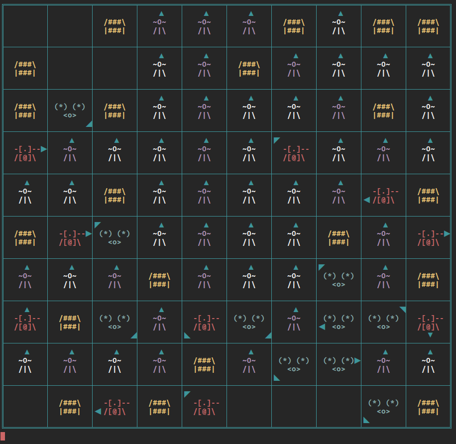

AsciiWorld
==========

AsciiWorld is a reimplementation of GridWorld with an Ascii (and Unicode) based output rather than a Java GUI based one.

It was completed as en exercise to get refreshed with the Java language and is far from becoming full-featured, documented, and bug-free. A much better implementation could be made by just forking the original GridWorld code.

The arrows on each Actor shows its direction.
* Yellow: Rocks
* Red: Bugs
* Purple: "Fresh" flowers
* White: "Dying" flowers
* Light blue: Actors

[Video](https://www.youtube.com/watch?v=NPXRDIHG-DE)
